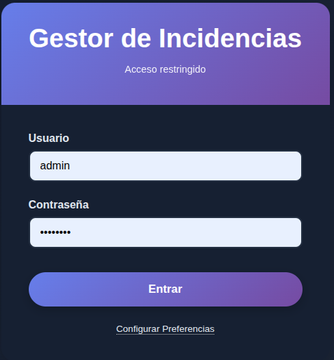
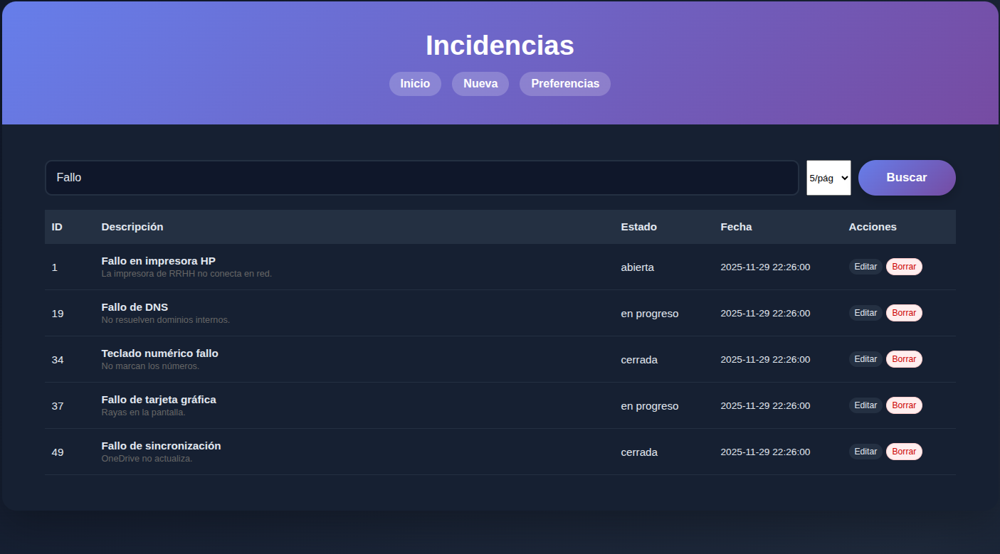
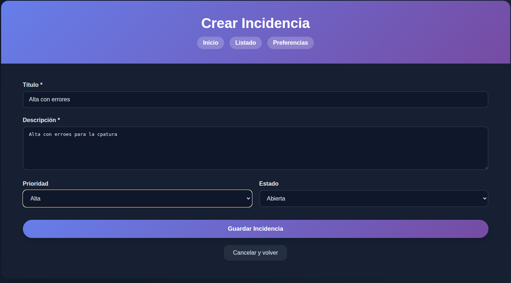
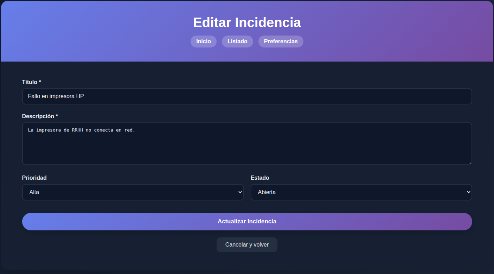
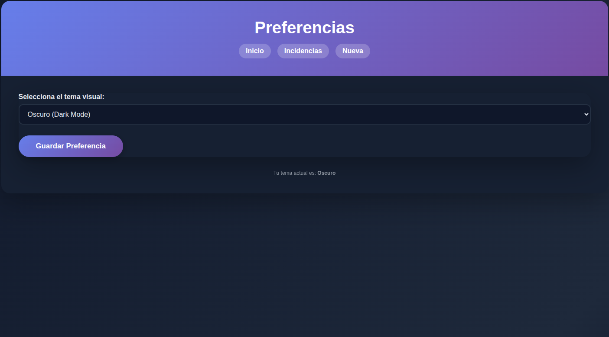
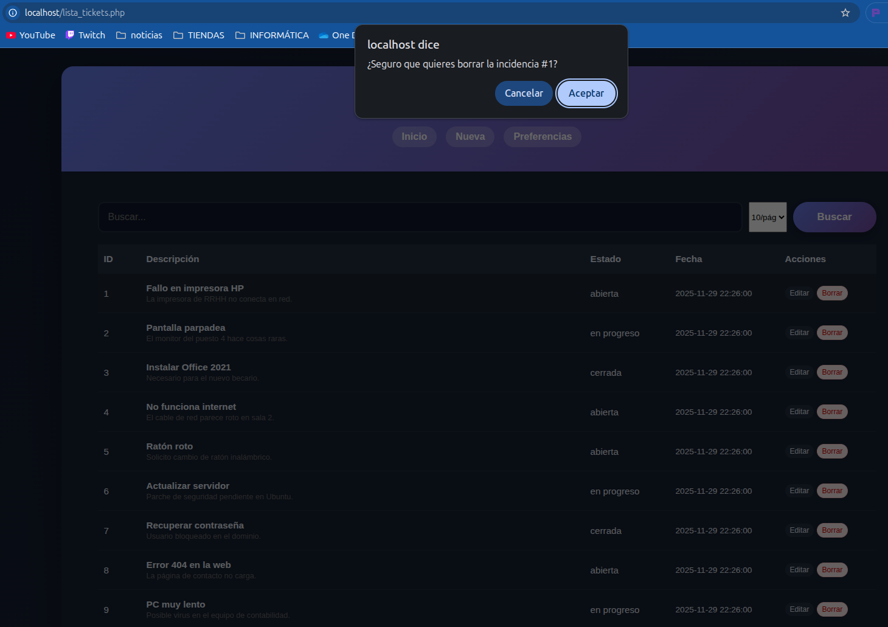
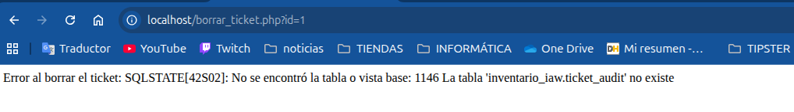
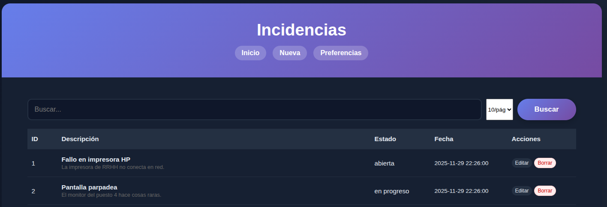

# Proyecto IAW - Gestor de Incidencias

> **Modulo:** Implantación de Aplicaciones Web (IAW)  
> **Curso:** 2º ASIR  
> **Version:** v1.0

---

## Guía de instalación y uso

### 1) Requisitos

- PHP >= 7.4
- MySQL/MariaDB
- Servidor web (Apache recomendado)

### 2) Preparar la Base de Datos

Crear la base de datos y cargar el esquema y los datos de prueba.

```bash
# Crear BBDD (introduce tu contraseña de root cuando se solicite)
mysql -u root -p -e "CREATE DATABASE inventario_iaw CHARACTER SET utf8mb4 COLLATE utf8mb4_unicode_ci;"

# Importar estructura
mysql -u root -p inventario_iaw < sql/schema.sql

# Importar datos de prueba (incluye usuario admin)
mysql -u root -p inventario_iaw < sql/seed.sql
```

Opcional: crear un usuario dedicado para la aplicación (ajusta usuario/contraseña):

```bash
mysql -u root -p -e "CREATE USER 'NoelYAngela'@'localhost' IDENTIFIED BY 'IAWAN'; GRANT ALL PRIVILEGES ON inventario_iaw.* TO 'NoelYAngela'@'localhost'; FLUSH PRIVILEGES;"
```

### 3) Configurar credenciales de la aplicación

Edita `app/pdo.php` y establece los valores de conexión:

- `host`: normalmente `127.0.0.1`
- `port`: `3306`
- `db`: `inventario_iaw`
- `user` y `pass`: el usuario MySQL que vayas a usar (cámbialos por credenciales seguras en producción)

### 4) Configurar el servidor web (Apache)

Recomendado: usar un VirtualHost con DocumentRoot apuntando a `public/`.

```apache
<VirtualHost *:80>
    ServerName proyectoIAW.local
    DocumentRoot /var/www/html/proyectoIAW/public
    <Directory /var/www/html/proyectoIAW/public>
        AllowOverride All
        Require all granted
        Options FollowSymLinks
    </Directory>
    ErrorLog ${APACHE_LOG_DIR}/proyectoIAW_error.log
</VirtualHost>
```

Habilitar el sitio y recargar Apache:

```bash
sudo systemctl reload apache2
```

Si prefieres probar sin Apache, usa el servidor embebido de PHP apuntando a la carpeta `public/`:

```bash
php -S localhost:8080 -t public
```

Accede a `http://localhost:8080`.

### 5) Usuario inicial

- Usuario: `admin`
- Contraseña: consulta en `sql/seed.sql`

---

## Estructura del Proyecto

```
/
├── app/
│   ├── auth.php         # Gestión de sesión y control de acceso
│   ├── csrf.php         # Generación y validación de tokens CSRF
│   ├── pdo.php          # Configuración y conexión a Base de Datos
│
├── public/              # Directorio accesible vía web
│   ├── css/
│   │   ├── base.css         # Estilos generales y layout
│   │   ├── theme-light.css  # Variables para tema claro
│   │   └── theme-dark.css   # Variables para tema oscuro
│   ├── index.php        # Dashboard principal
│   ├── login.php        # Inicio de sesión
│   ├── logout.php       # Cierre de sesión seguro
│   ├── lista_tickets.php # Listado con paginación y buscador
│   ├── ver_tickets.php   # Vista detallada de una incidencia
│   ├── editar_ticket.php # Formulario único (Crear/Editar)
│   ├── borrar_ticket.php # Lógica de borrado con transacción
│   ├── crear_usuario.php # Registro de nuevos administradores
│   └── preferencias.php  # Selector de tema visual
│
├── sql/
│   ├── schema.sql       # Estructura de Tablas (DDL)
│   └── seed.sql         # Datos de prueba iniciales (DML)
│
└── deploy.sh            # Script de despliegue automático
```

---

## Resolución de problemas (FAQ)

- **403/404 al acceder:** confirma que el DocumentRoot apunta a `public/` y que Apache tiene permisos sobre `/var/www/html/proyectoIAW`.
- **Extensión `pdo_mysql` no cargada:** instala/activa el módulo de PHP y reinicia Apache.

---

## Capturas de pantalla

### Login


### Listado con paginación


### Búsqueda aplicada


### Alta con errores


### Edición con errores


### Cookie aplicada (tema claro/oscuro)


### Intento sin sesión (redirige a login)


### Prueba de rollback (borrado fallido con transacción)

**Paso 1:** Error en borrado (falla la auditoría)



**Paso 2:** El ticket sigue activo (rollback efectivo)



**Paso 3:** Restauración y borrado correcto


